## **VERSION 1.99371 - January 20th, 2025**

*Compatibility release with Midnight*

***BUG FIXES***

* Fixed an issue where after the Anniversary TBC migration - some player alt group data was misaligned. This is because it kind of messed with how the alt group indexing worked and so you ended up with players in mismatched alt groups and missing birthday info (birthday data is indexed and shared among all players in an alt group). This would make your audit window not be able to load properly. This is now fixed.

* Fixed an issue where the join date would not import properly on the first toon of yours joining a guild. It would self-fix on reload or your next login, but now, it should properly import the join date of all of your toons the first time they join a guild.

* Fixed an issue with the Hardcore Mode indication that you want to join the Hardcore channel to listen and track HC deaths. You HAVE to join the channel for this GRM feature to work, so GRM indicates to the player on login if they want to join or not, and it is a one-time message. Well, the window would go away and hide too quickly on accident. This is now fixed. Please note, if you alread already joined to the HC channel, then you will not see the notification.

* Cleaned up the Titan Panel integration slightly. It is formatted better and the name now shows in the General settings.

**QUALITY OF LIFE**

* The list of all Realms has been updated for all regions and all builds of the game, from Classic Era, HC, Anniversary, MoP, and Retail. When creating a x-realm ban, no need to manually try to type in their server name, all the servers will be listed and an autocomplete suggestion as you type to filter through and get the name perfect. This is less useful for banning existing players or former members from your guild.

I wrote my own custom software to parse out all the realm names from all regions, from all builds, wchi is quite a lot. It then exports this data into a Lua formatted file that GRM uses to import the data easily. You can [See the software here](https://github.com/TheGeneticsGuy/WarcraftRealms)

## **VERSION 1.9937 - January 14th, 2025**

*Compatibility update with TBC Anniversary Release*

***BUG FIXES***

* On new anniversary expansion releases, in some cases Blizz tweaks the GUIDs of the player. This has bad consequences for GRM. I wrote a way to detect and avoid losing your guild player data as a result. If it has already happened to you, if you have a backup GRM savedVaraibles file just restore it and load the game again.

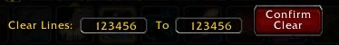

***QUALITY OF LIFE***

* The GRM Log Options (click button below the log color filters on the right) now can delete more than 9999 log lines at a time. It now can do over 100,000+.

## **VERSION 1.9936 - December 29th, 2025**

**GRM Now has an official website** - [www.guildrostermanager.com](https://www.guildrostermanager.com)

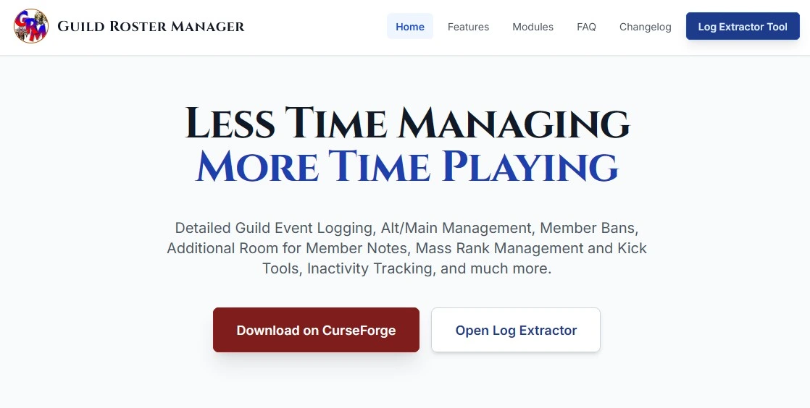

* As of now, the main feature is a tool to extract your log from the GRM save file, but more will eventually be added...

*Compatibility update for MoP Classic 5.5.3*


***BUG FIXES***

* The main name and the alt/main tags were not properly getting added to the chat for addons like Prat since the 11.2.7 release and various API changes. I thought I had a solution to resolve that, but it ultimately was not quite sufficient. So, I built something else and I can say that this is a universal compatibility solution so no conflicts with Prat or hopefully other addons like ElvUI Chat (though I have only tested Prat and can at least confirm the issue is resolved there).

* Fixed a bug where the join date was not getting imported properly for your own alts and the addon was also not importing your own guild join date properly. GRM has the ability to query the server and import the join date to your current guild (as long as you joined it AFTER the communities implementation in 2018, or when Blizz added that update in Classic). Only you can query your own data, so unfortunately you can't get other guild members' join dates this way, but GRM will now properly import your join date and also add your join date note to your assigned note location.

* Fixed an issue where if anyone was using the '!note' tool with multiple officers online it could potentially be spamming in updating the player note. It now should properly report a single note update.

***QOL***

* There was an issue where GRM was only reporting inactivity of toons in an alt group if ALL of the alts were inactive. This is actually a configurable setting but it added some confusion as what if an alt was active, a main wasn't, and the main returned, it wouldn't inform you they were returning from inactivity. Now, that option is disabled by default, and it will ALWAYS report an inactive "main" returning, so this setting only specifically applies to alts.

* Mandarin (CN) localization work has been updated. Thank you 阿拉贝比-回音山 for your continued amazing work!

## **VERSION 1.9935 - December 3rd, 2025**

*Retail 11.2.7 Compatibility Update*

***BUG FIXES***

* All bugs related to the 11.2.7 API changes have been resolved and fixed. Thank @lenni on Discord for assisting in this process as he was very proactive on the beta/PTR regarding this

* Fixed an issue where the join date was not properly getting added to the player designated note for when you had your own alt join the guild. GRM has a neat little feature where if you are on an alt and join the guild, it will auto-set their join date imported directly from the server (you can only do this for your own toons), but I had forgotten to make sure you also updated the player note for your own toons when doing so. This is part of the feature where your own alts automatically get added to your own alt list.


## **VERSION 1.99347 - Nov 3rd, 2025**

*MoP Classic 5.5.2 Compatibility added and 1.15.8 Classic Era Compatibility Updated*

***BUG FIXES***

* Minor bug could occur on the tooltip in the macros when switching between tabs a lua error could pop.

* Fixed an issue where settings wasn't loading properly at login and could cause error.


## **VERSION 1.99346 - October 20th, 2025**

*MoP Classic 5.5.1 Compatibility added - Sorry, I didn't realize this had been updated*

**NEW TOOL - GRM Log Extractor**

As some of you maybe have experienced, you can sort of reach the upper limits of storage size that Blizzard allows guild addons. There isn't an exact disclosed limit by Blizzard, but it is there, and eventually, it will nuke your Save Variables file. This is not due to any kind of stack overflow errors, it just seems to hit an upper limit and torpedos the file. The vast majority of memory used by GRM is in your log data. GRM does not just store your log entries as simple strings. Each log is the processed string of text, including all of the metadata used to build that string. The reason I store all the metadata of the log entry is so if you change timestamp formatting, or if you change your language selection, the strings can be reprocessed into the new localized language, or the timestamp formatting updated. Also, it allows me to more easily enhance the log with some mouseover features, including the ability to CTRL-CLICK certain entries to bring up the player's mouseover window from that entry. Without the metadata, it would be far more complicated to attempt to parse each string for names.

Blizzard does not allow Warcraft addons to write to file, so you cannot actually export your log to a text, CSV, or any other format from within the game. To attempt to deal with this, right now, I have the GRM EXPORT window (`/grm export`). This allows you to copy about 500 lines of the log at a time. This is limited in size because it is technically just creating a giant input box and adding text, but I found once you are past about 500 lines, it can get really laggy and buggy, so I keep the limit there. Well, imagine being a guild with 20,000+ log entries. This is going to take a while to export.

As such, I created a new web app, the GRM Log Extractor


As you can see, it can handle massive GRM save files. This guild had over 100,000 log entries.

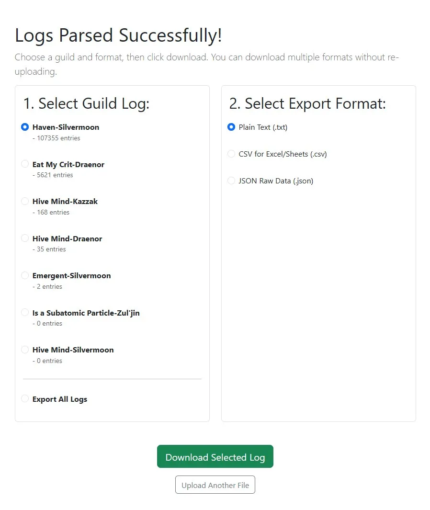

[Click Here to Try it Yourself](https://extract.guildrostermanager.com/)

***QOL***

* Since not everyone reads the changelog, or Discord, I have also include a link to the Log Extractor from within the addon:

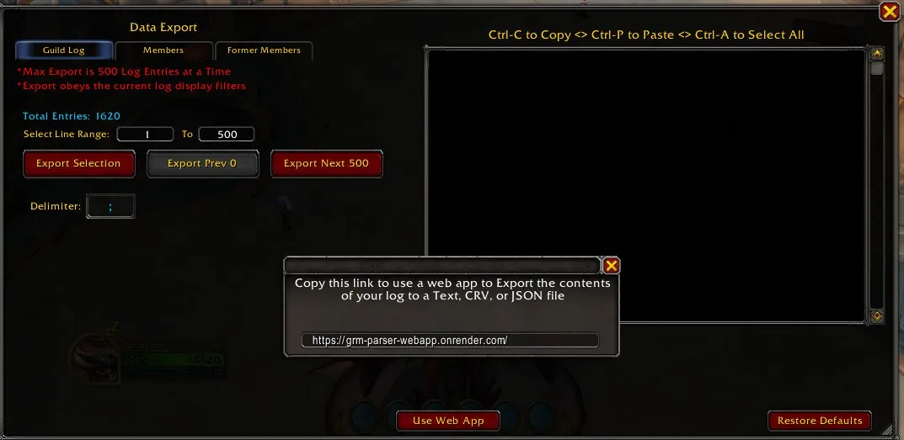

* New Slash Command - `/grm altlimit X`
  - Note, the X can be any number. If you are in a mega guild, some times it can be useful to set a limit to the amount of alts a member can have. This audit will allow you to see if there are any alt groups over your alt limit. If you say `/grm altlimit 8` then the report will give you the alt groups that have 9 or more total players in the group (including the main).

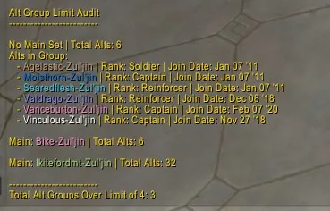


* The Simplified Chinese translation has been massively expanded. Thank you 阿拉贝比-回音山 for making that happen!

***BUG FIXES***

* Fixed a bug that couple possibly stop sync from happening after logging in. This is sort of a hard one to diagnose so it might not be the fix, but it COULD be. Please let me know if you are still getting a statement that says something along the lines of this "Given the unusually long time of {num} seconds and sync is still not availble..." - If that is still happening, and you are showing NO LUA errors, then there is a logic flow error somewhere I think. Otherwise, it is fixed!

## **VERSION 1.99345 - October 14th, 2025**

**QUALITY OF LIFE**

* TITAN PANEL SUPPORT - If you add the GRM minimap icon to Titan Panel, the supporting text next to the icon will show guild members online.

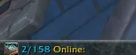

* German Translation has been completed for the entire addon. This is an experiment in using AI to assist in localization. I gave the AI my German localization file and asked it to update the file with all remaining translation work. It would be really helpful if anyone with German fluency could check the AI's work. For fun, I then passed the file to a separate AI and asked it to assess the quality of the trasnlation and it approved it with minimal suggestions. I then opened every UI element in the game and made hand-crafted adjustments to ensure that the suggested translations fit within the existing Interface, and some changes had to be made (German often has extremely verbose and lengthy words). Overall, I think it went well, but I'd be really happy to hear from an actual native speaker.

**BUG FIXES**

* Fixed an issue where certain languages, when setting join/promotion/birth dates it could cause an error as it was not indexing the selected month properly. This will no longer happen. This will also fix any bugs that were created by storing bad data from doing this.

## **VERSION 1.99343 - October 11th, 2025**

***Quality of Life***

* Added an improved translation file for Mandarin Chinese localization work. Ty @Blendomino for that contribution!

* The Minimap button, on hover, now includes the number in your guild that are online. Ex: `12/350 Online`

***BUG FIXES***

* GRM was not auto-adding your own alts to your alt grouping. GRM should have been auto-tagging your own alts to your own alt grouping. It should now be doing that properly. Yes, this will work retroactively if you go and log in each alt now. It is a one off though. If you remove the alt from the group, the next time you login it will not auto-add back to the group as the addon will assume that move was intentional and not be forcibly overridden.

* Merged a bug fix PR sent by Github user "Earthenmist" that could cause an error on load if settings had not fully configured at the start.

## **VERSION 1.99342 - October 10th, 2025**

*Compatibility Updated for 11.2.5*

***BUG FIXES***

* On occasion GRM was failing to properly query the server for roster data on specific players, for whatever reason, it would just return nil on first query. This should no longer occur and no longer cause the scan for changes to fail in the middle of a scan. This seemed to happen more right after logging in.

* The export log would occasionally throw a Lua error in some cases. It didn't actually break anything, but the Lua error is now eliminated and won't spam your bug collection.

* Fixed a bug where when changing the timestamp format, language, or 24hr/12hr formatting, in the Options, it could error when it re-processed the log to make those settings changes. This should no longer occur.

* Fixed a bug where a Lua error could occur on the alt group sync data and end up causing the sync to fail.

* You should no longer get a bunch of "No longer On Server" reports erroneously, but this is a little tough to test live so if you can please report back any issues still that would be great. Thanks!

**VERSION 1.99341 - August 14th, 2025**

**BUG FIX**

* Fixed the `GRM_API.GetMember` function. In addition, I added a new function `GRM_API.IsGuildMember` for public use, like in weak auras.

## **VERSION 1.9934 - August 13th, 2025**

***BUG FIXES***

* The faction icon will no longer default to Alliance when the server returns nil on the player mouseover. For some reason, in patch 11.2, the guild member API to get the faction is no longer returning the info of guild members' faction from the server for the x-realm guilds in retail. So, when the faction is not determined, I just hide the icon now. This probably is only affecting retail builds since classic hasnt't had any updates, but either way, in classic I am not basing the faction just on your own faction, which can be determined, since there aren't actually x-realm guilds. I have submitted the bug report to Blizz to hopefully fix the API.

* It was reported that some might see the GRM windows close whilst they are flying from zone to zone. This is because GRM will auto-close the addon windows if you enter combat to prevent GRM frames from "eating" your keystrokes. It's not an issue with most of the frames, but ones I have added logic like where you can press ESC key to close it, out of convenience, this can happen in combat due to some API restrictions blizz put in in recent years. Now, I have enhanced this so this logic doesn't hide the frames IF you happen to be on a flightpath. Reality is you can actually enter into combat by flying near mobs on a FP, even if for just a short moment, even if it doesn't affect your gameplay at all, but because GRM was listening for the in-combat flag to flip to hide the frames, it would do it. Now, this will no longer happen whilst flying.

* Fixed a bug where occasionally after a loading sreen, like after exiting a dungeon, a Lua error could occur as some settings hadn't fully reloaded before the addon checked them. This is now resolved.

* The alt and main tags should now be properly showing again in chat, or when a player logs on or off, if you have the "show main name" unchecked.


## **VERSION 1.9933 - August 6th, 2025**

*Compatibility Release for 11.2*

**QUALITY OF LIFE**

* You can now right-click the GRM custom roster `(/roster)` and select multiple names to be added to the macro tool at a time. There is no limit, you can just keep right-clicking and adding actions to be qued up for various players manually before you finally use the macro. Be aware, that you can only add multiple of the same type of macro action however, so you can right click and add a bunch of names to be kicked, but if you right click and decide to add a player to be promoted whilst you are adding a bunch of players to be kicked, it will wipe all the names you have qued. You can combine the promote/demote actions, just not the kick. I did add a little confirmation window to confirm that you wish to do that as it would kind of be a pain to accidentally overwrite names you've queued up.

* Professions are now able to be loaded to your player notes again. This was restricted to Cata Classic and below previously. This has been updated.

***BUG FIXES***

* Players should no longer be spammed that a guild member has name-changed. This is actually not a GRM error, it appears to be a bug related to the 11.2 update and an error on Blizz's end. Shortly after logging in, where querying the names of the players in your guild, the server is returning incorrect names by having them return with repeated copies of the realm name. This only seems to be affecting some, not all, x-realm guild members. So for example, my name would instead of `Arkaan-Zul'jin`, I query the server and I get `Arkaan-Zul'jin-Zul'jin-Zul'jin` and so on. I've seen it copy as much as 10 times the realm name. So, GRM was saying "Looks like a new member, but then when it scans the roster it goes, "Wait, this player has the same GUID as an existing, it must be a name-change... All I did was bandaid Blizz's error here by parsing out the repeated copies of the names. So, you will no longer be spammed after logging in with the name changes.

* The Guild log should now be filtering properly again with the checkboxes. In addition, your numbered lines if you enable or disable should work. The scrollbar should work again, and so on. Sorry about that, this was a slight oversight of a stealth fix I did for something else I didn't consider all the downstream consequences, of which there were many. Just note, the log should now be functioning normally again, as well as it's filtering.

* If you do not have permissions to use the macro tool, the rules should no longer show for you and there will no longer be any lua errors trying to enable/disable rules if you don't have guild rank permission to kick/promote/demote.

*  Fixed an issue where a Lua error could occur causing syncing to fail if someone in an alt group leaves a guild in the middle of a sync, and you still try to sync their name. They are now removed from the guild, but it was still trying to sync their alt name. This will no longer occur.

* The disabling of the log chat spam while using the macro tool should now properly block the spam of the "recommendations" when you check or uncheck rules to be on and off. This retriggers a scan on the recommendations report, but it will go to your log and if you have it checked to block the spam it now should.

* Fixed a bug where the script could run for too long on checking for dead accounts. This was sort of overlapping of another bug so is self-fixed by fixing the other.

* Fixed a bug that seemed to happen if you were scanning the roster for updates whilst zoning, you could throw an error regarding the macro rule matches. This will no longer happen.

## **VERSION 1.99321 - July 21st, 2025**

* Quick hot fix due to log search not working. It is once again working! Oops!

## **VERSION 1.9932 - July 21st, 2025**

*Compatibility Release for 5.5.0 MOP*

***BUG FIXES***

*Please note, more bug fixes are coming soon, this is mainly just to rush an update out for MOP release*

* The GRM guild log would cause stuttering if you had a significantly large log and you were utilizing the search parameters. If the search parameters were clear it wouldn't, but if they were there, it was refershing the log needlessly even if no log changes. This now is fixed to be efficient and not cause that.

## **VERSION 1.9931 - June 17th, 2025**

*Compatibility Release for 11.1.7*

***BUG FIXES***

> Fixed an issue where if your log and player database got insanely large you could end up causing a stack overflow, bypassing the 32-bit max nature of a Lua save table which can only have a max of so many indexes, which would corrupt your save file when Warcraft writes to file on logout or reload. It would fail writing to file. This is because of the restore point that could be added essentially doubling the data. Example, the person this happened to had about 130,000 lines in their guild log, and the database had data for over 4000 former members in it (this is far less an issue than 130k log lines lol). This is a lot of info lol. Anyway, not a huge deal, I just broke up the restore point into separate tables rather than having it be stacked with all guilds in the same restore table for all players, so logs have their own restore point, former members, and so on.

> Furthermore, I have added a warning, with info, when you reach certain data limits. This is just a helper and most of you will never see it. I set an internal estimate of a max cap of roughly 100k log lines stored, to prevent issue, yes, it can go much higher, but just for clarity. And, now, if a player reaches account-wide 50k, 75k, 90k, and 100k+ log lines stored, at each of these milestones they will be notified of reaching this data cap with a recommendation to cleanup the log table.

Example of the Message for someone > 100% storage capacity.

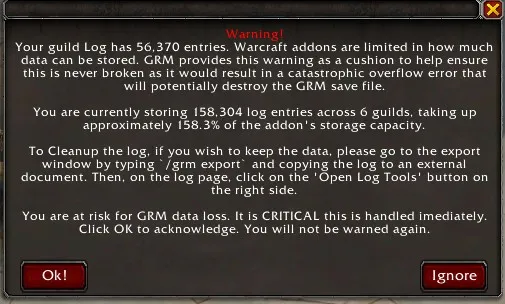

Again, you CAN have more, but I give GRM a nice cushion to warn you will in advance of the true internal cap.

* Fixed a bug where the GRM log was not updating properly until you closed and reopened it in some cases. It should now properly update on the fly.

* Fixed a bug where if you were in the GRM custom roster, sorting by rank, and you search had zero matches it would throw a lua error. This will no longer happen.

* Fixed an issue where you would be unable to export the player or former member data as the rankName was missing, causing a Lua error crash. This is now fixed.


## **VERSION 1.9930 - June 8th, 2025**

***BUG FIXES***

* Fixed a bug where the macro tool would no longer load promote, demote, or special rules if you had previously configured an activity check to promote at 0 months. This is now fixed and your macro tool should load properly again.

## **VERSION 1.9929 - June 6th, 2025**

***BUG FIXES***

* Fixed a bug that would prevent the addon from fully loading.

* Fixed an issue where it was not fully updating the last online status of a player immediately  after logging in, before checking the macro rule matches. So, you might get false positives on inactivity immediately after logging in, though it would self-correct within a minute or so, but it could give a confusing announcement to see a name reported as being a match, then you open the tool and they aren'ty there anymore. This likely would not be noticeable to most, but it can happen.

## **VERSION 1.9928 - June 5th, 2025**

***BUG FIXES***

* Fixed an error that could prevent GRM from loading entirely due to the lastOnline variable being missing. This is now resolved.

## **VERSION 1.9927 - June 4th, 2025**

***BUG FIXES***

* Fixed a number of Lua errors that were causing some scanning to fail, macro tool to load, or even the GRM custom roster window to load. They all should now properly updated.

* Fixed a slight bug with the demotions macro tool where you could add a custom message to a player note destination. It now variably informs you that the max length of your note is 31 in officer/public, or 150 in custom, due to the size availability of the note. It was stating they all were limited to 31 characters previously (the Blizz default note size that does not apply to the custom GRM note).

## **VERSION 1.9926 - June 3rd, 2025**

***NEW MACRO RULE FILTER - DEMOTIONS***

When a player is demoted, you now have an option to leave a custom message automatically in either the public, officer, or custom note location (default is officer).

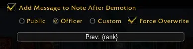

* Add the brackets `{rank}` anywhere in your custom message to include the previous rank name automatically. Please be aware, you are limited to 31 characters max when adding to say, your officer note (Blizz server restricted limit), so the message and rank name need to fall within that limit otherwise it will ignore it. It also will NOT overwrite a pre-existing note, like say, a join date, unless you allow it to overwrite it. It will only overwrite if allowed and there is not enough room for both the original note details and this new message. Otherwise, it will just be appended to the end.

> Example for 'Officer' Rank: `Prev: {rank}` would appear as `Prev: Officer` when added to note.

***BUG FIXES***

* A lua error could occur in the scanning process in some circumstances, notably after say, promoting/demoting a player, it would error out and then not validate the changes made until you /reload. This did not affect all people. But, it could happen. It is now resolved.

* Fixed in era in Classic builds where the professions were not updating properly and were ending up as empty values. The professions should now properly re-update correctly.

## **VERSION 1.9925 - June 1st, 2025**

***BUG FIXES***

* GRM should no longer cause any lag or stutter. This was my fault. In my rush to quickly get out the last update, I had left in some code where I was stress testing the scanning a bit using the Communities API instead of the older Guild Roster API. I meant to remove it, but I left it in for release. Furthermore, this was actually part of a small project where I was restructuring some of the scanning to make it a bit more lean on the back end and I made some signficant improvements in efficiency. Regardless of that, the lagginess was fixed.

* Fixed a Lua error that could occur if the user does a hard reset `/grm hardreset` which wipes the entire save file of the addon and starts as if GRM was never installed before. This is mostly for internal testing so I don't recommend using this yourself.

## **VERSION 1.9924 - May 30th, 2025**

***BUG FIXES***

* Erroneous leaves and rejoin reporting to the log should stop. In addition, I added a patch that will attempt to identify and cleanup the erroneous leave and rejoins, and if found, it will remove those from the history tree of your join dates and rank promotions and restore your original date as the top level "current" date. Please note, if you never had a date configured, you will see a placeholder date marked with "!!" there as an indication that you do not yet have a verified join or promotion date configured for that guild member.

* Erroneous Death logging in Classic Era HC mode should stop

* A bug that could occur when scanning the log that didn't really break anything, but did throw a lua error is no longer an issue.

* Players that had a kick rule set to inactivity check at 12/24/36/etc... year marks was reporting for ALL members of the guild to be kicked in error due to a coding error will no longer do so. This was self-resolved if you had any other months set, like 11 or 13, for inactivity, but the 12 month one would recommend for all. This is now fixed!

## **VERSION 1.9921 RELEASE - May 23th, 2025**

***BUG FIXES***

* The Custom GRM Roster's right click functions to promote/demote/kick should be working again when sending them to the macro tool. With the last update the Macro Tool would show the name for about 1 second and then refresh back to it's normal state. It now should keep the custom names added to it.

***QOL Enhancements***

* A small message now indicates in chat after logging in if GRM has been updated, even if there was no patch applied, just an updated version. Previously, it only mentioned if pathces applied.

* Scanning process was slightly optimized even further, as well as the macro tool leaned out even more on the backend underlying code.

* Color picker frame spacing cleaned up. Not sure why Blizz default frames button (even with all addons off), overlay the rgb. This is now spaced better.

## **VERSION 1.992 RELEASE - May 22nd, 2025**

***PENDING NEW FEATURE - AlMOST COMPLETE***

**NICKNAMES**

I am almost done with implementing the long-awaited Nicknames feature. However, this patch has become quite large so I wanted to do a sort of pre-release with a lot of Quality of Life(QOL) enhancements and Bug Fixes first rather than take another week or two to finalize the nicknames feature, depending on how much free time I have. However, just be aware, the feature is being currently built, is my number 1 priority right now to be complete, and you will see it soon. Look for some details in the new Options > Names tab. Please note, this is a very vague representation of what the nickname feature will show, and I have a little surprise to drop when I get this out as well that I think people will be pleasantly surprised with. Keep an eye out for the pending new nicknames feature soon!


***QOL ENHANCEMENTS***

* Easily remove profession details in Classic Builds of the addon from any of your notes, be it public, officer, or custom notes. I know some people may have accidentally added them, or they have decided to no longer use the feature, and they would like to remove all of the profession notes. You now can do it with the easy click of a button.

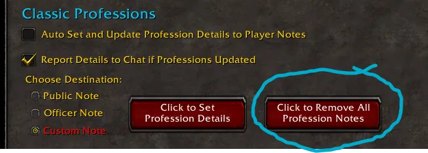

* More optimizations have been made in cleaning up the code and optimizing certain processes to sort of modernize some of my GRM development. Rather than do it all at once, as we are talking tens of thousands of lines of code, I am doing it in chunks. This update include a significant update to the scanning process when updating player info and scanning for changes.

* When recommending someone to kick, or be promoted/demoted, GRM was not using a very precise method of calculation, but instead an average of the time. So, if you had say, 3 months to kick, GRM was kind of going the lazy way out of just taking 365 days / 12 = 30.42 average days in a month, so 3 months would be 3 x 30.42 days x 24hrs (roughly 2190 hrs). While this is ok, it's pretty reliable, you can end up at times where the Macro tool might be recommending to kick someone as they are at 3 months offline, but you look at the player mouseover window and it says they are at 2 months 29 days, or something like that. GRM has been updated to now do this strictly with day-clamping. I feel like it's just a better overall user experience. For example, if a player went offline on January 10th, then the recommendation to kick at 3 months will be April 10th. While this means that there may be slight time differences on 3 months as some months are shorter than others, it will be a far less questionable user experience when the mouseover reflects the last time offline and correlates it better.

* In an attempt to resolve the issue where custom channels will occasionally disappear in a session for some reason, if you had created a custom GRM messaging channel, and the game removed or loses your channel (sort of a weird anomaly that can happen), a popup box will appear asking if you would like to restore the missing custom channel, or if you would like to ignore it. This can happen as well if you right-click and remove the channel without adjusting the GRM settings, GRM will ask you to confirm to change the settings. Please let me know if you are consistently losing the channel over and over again as maybe there is something more I can do to try to debug the issue. I disabled all addons and I was able to inconsistently recreate the issue where I'd make a new chat window, log off, login and it was gone, but reloading it never went away.

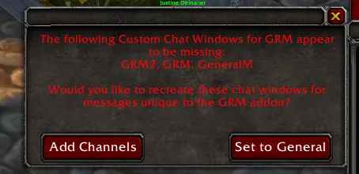

* Macro Tool Scanning for macro rule matches of guild members has been completely overhauled and rewritten and is far leaner. Before, if you were in say a 800-900+ member guild, and you had a dozen unique rules, then in some cases some stutter could happen when scanning for rule matches, especially if you had a lot of matches, like you need to shift a few hundred guild members to other ranks. The stutter was BAD. I now rewrote the entire process to simulate asynchronous functionality and it is far far leaner and faster. Just in my own internal testing, I know no guild would ever hit this, but I simulated a 2000 member guild (in case Blizz ever gives us that), and I setup 40 macro rules to scan the whole roster through, matched over 5000 names for rules across kick/promote/demote/special, and I got ZERO stutter or any noticeable processing signs on the front end. It worked extremely effectively. This should be a significantly better experience overall for large guilds, even though small guilds might not notice any difference at all.

* The Promote, Demote, and Special rules in the macro rule will now also sort the names of the players in the last to be in their main/alt groupings, just like it works on the Kick rule.

* The Custom Log Entry message option at the bottom of the macro rule filter options will now save the text that you add there without you being required to hit the ENTER key. Whatever you type will be auto-saved on Confirming at the bottom. You can still cancel what you typed by pressing the ESC key to lose focus and reset it back to what it was, but now you can just type and confirm. Before, if you didn't hit ENTER it would wipe whatever you typed and not save it, and I found that kind of annoying.

* The Macro rules now have an additional option on the safe text match where you can set it to match not just the default officer note, but you can search for the "safe" tag you have designated in any notes. This was implemented as someone indicated a scenario in their guild where people can put certain tags like "Vacation" or something like that in a public note which will protect them from being kicked. Previously, only tags placed in officer notes were considered.

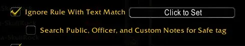

***BUG FIXES***

* Fixed the scanning that could result in too much scanning through at the same time, causing a potential timeout. This is now handled a little more divided to prevent any chance of stutter or timeouts.

* Fixed a bug where upon kicking a player from the guild, particularly a player who was an "alt," they would not refresh and be removed from the macro properly until you refreshed it. This one had been eluding me as it ended up being an internal GRM issue with frames refreshing when they shouldn't have been, so it was a little difficult to track down. It is now FINALLY resolved.

* Fixed a bug where if you were in Classic and you were using the profession feature, it was skipping adding profession notes to any player who had the letter `D` in their player public note. Why? Well, it was a carryover check from my Hardcore realms where it made zero sense to add the profession data to players that were marked "Dead" with the `[D]` tag. Well, on accident, I was matching just the letter D, not the full [D] tag, which meant that any player who had just the letter `D` in their player note it was not adding profession details to it. Oops! This has now been fixed.

* Fixed an issue where setting birthday to unknown would persist even if you set the proper birthday, it would not overwrite the old birthday is uknown setting. Fixed.

* Fixed a Blizzard issue in CLASSIC ETA - For some reason, even with all addons disabled, the player windows were not displaying officer notes. I was able to extract the officer notes myself from the server and force them to be displayed properly even though Blizz has introduced some kind of bug that makes the officer notes not appear.

* Fixed a bug where the RGB coloring of the Main and Alt tags had the 'G' and 'B' color flipped, so it was passing RBG instead. This would flip your color scheme. It might not have been noticeable if you were using red, since that flips to red and red, but if you had changed the color to say Blue, it would display your tags as green lol. So ya, I am really surprised no one had ever reported this.


## **VERSION 1.99171 RELEASE - April 24th, 2025**

* Minor bug fix that would keep the Custom GRM Roster from loading due to a lua error. This should no longer occur.


## **VERSION 1.99170 RELEASE - April 22nd, 2025**

**COMPATIBILITY RELEASE 11.1.5**

*Please note as well, the ElvUI AddOnSkins has been updated. It is not always clear with the AddOnSkins dev will accept my file for merge, so you can [download it manually here on Github](https://github.com/TheGeneticsGuy/Guild_Roster_Manager_AddonSkinsFile)*

***ALSO - BUG FIXES***

* Fixed a bug that could occasionally cause a Lua error if someone joined/quit the guild in the middle of checking for player changes.

* Export of members data should once again work. It was not working if you had birthday info checked for export.

* Fixed a bug where the "Invite" button on the player mouseover window was saying "No Invite" - This will no longer do this and behavior will funciton normally.

* Fixed an issue where the "Last Online" would in some cases state something like "4 years, 12 mos, 8 days." Well that doesn't make sense. It should just be 5 years and 8 days. After investigating, I found that the actually game server provides the last online numbers and returns them as this format. So, I adapted them to properly roll those 12 months over into an additional year.

* Cleaned up the punctuation on the "Last Online" report as if there were no months it was not punctuating it.


## **VERSION 1.99169 RELEASE - April 16th, 2025**

***BUG FIXES***

* For real this time, the guild rank name change spam is going away. This ONLY affected people who added/removed/renamed ranks since a recent update. Sorry about that!

* Possibly fixed an issue where it was reporting on lower ranked alts that your "special" tool had guild matches, but your current rank couldn't perform the macros as you were too low, but your higher ranked rank could... then, you log to your higher ranked alt and nothing. So, I *THINK* I got that resolved, but it was a little weird, edge casey, and hard to verify. The logic is sound though, so if this affected you and it's resolved or not resolved, please let me know. This is only for people who use the "Special" macro rules for syncing alts to certain ranks or same rank as main.


## **VERSION 1.99168 RELEASE - April 14th, 2025**

*Hey everyone - sorry about the speed releases - things should calm down now I think, at least after the 11.1.5 update!*

***BUG FIXES***

* Fixed a bug where the birthdayInfo was missing for some players and thus various features wouldn't work, like audit window and would spam errors. This is fixed.

* Fixed an issue where on occasion, you would say, mass kick using the macro tool, a bunch of names, but a couple of them, even though the chat says they got kicked, the log says they got kicked, and the guild roster confirms they got kicked, their names would linger in the macro tool. It should now properly clear all the names.

* A couple of Lua bugs that could pop when joining a new guild should no longer happen.

*Thank you for the continued bug reports!!!*


## **VERSION 1.99167 RELEASE - April 13th, 2025**

***BUG FIXES***

* There was a bug where you would get spammed that ranks were being removed from the guild, then added back to the guild when you zoned. This should no longer happen.

* birthdayInfo player variable was throwing an error for some people. This will no longer happen.

## **VERSION 1.99166 RELEASE - April 13th, 2025**

**COMPATIBILITY RELEASE - Retail 11.1, Cata 4.4.2, Classic Era 1.15.7

***BUG FIXES***

* **CLASSIC ERA SYNCING - LONG EXPLANATION OF ISSUE**

  - So, after a lot of debugging, and I know this has long been delayed, but I had been hitting a bit of a wall where I traced the error all the way to sending a message across the Blizz realm server to basically do addon to addon comms with another addon user. Well, this is where the trace stopped and why sync couldn't really continue. You see, every message I send is tagged numerically with an incrementing message up. So, as I send each message, let's 1-100, the addon user on the other end will collect message 1-100. This is done for 2 reason. One, for some unknown reason, messages can be received out of order. I probably has to do with the way Blizz handles receiving/processing asynchronously on the backend, but I am not sure. So, the server process the messages, then forwards them on. They might be received slightly out of order. This is sort of problematic if I am sending a lengthy say "custom GRM note" that is broken into separate message. Well, GRM will reassemble the message in the correct order.

  - Well, the other issue is on rare occasions, sometimes messages seem to disappear. Rare, but it happens, and sometimes it's as little explanation as unexpected lag spikes, quick loading windows that maybe interrupt the message being sent, etc... The nice thing about this, is I wrote fairly robust redundancy into the syncing where if let's say the message #19 was missing of the 100, then the player will send a re-request just for the missing #19. And, then it will be re-sent, and collected. This allows the sync process to be a little more reliable and fail less due to incomplete info. On retail, I have not had any issues regarding this.

  - So, for some reason on Classic Era after the 1.15.5 (or 6) update, messages just started disappearing en masse. Like, I would send 100 messages, just in a test, very simple, short, clear messages to another account. I'd send 1-100, and 2 dozen of them would be missing. The request would auto go out for the missing messages, and maybe 4 or 5 of them would still be missing on the re-send. OR, even worse, the request itself would just disappear and never arrive lol. I tried variations on the messages. I thought maybe some prefix was killing it, some bad text code. But nope, nothing would change it. VERY hard to debug, and I seemed to hit a wall.

  - Finall, this week, 1.15.7 drops on Classic Era, and boom, the error seems to go away and self-resolve. Remember, this error has not plagued Retail. This seemed to be isolated to Classic builds, even though they shared the same codebase. So, my only explanation that I can think of is that Blizz maybe inadvertantly introduced a bug that affected only Classic, and in this latest update they did an unpublished bug fix on the backend and it fixed it. I Hope it is really that simple. But, I just wanted to say, before people try to thank me for fixing the syncing bug, this was NOT me at all. I didn't pull any magic, or fix my broken code... it was 100% related to the 1.15.7 update which seemed to fix the issue on it's own. Thank you for your patience and I am sorry you had to go through this frustrating bug I didn't really have a solution, yet, to resolve.

 ***BUG FIXES CONTINUED***

* The minimap icon was not showing after joining a guild until you reloaded or relogged. This should now properly show once you join a guild.

* Fixed sort of an edge case bug where if you delete a toon then create a new toon under the same name, it will get added to an alt grouping and their rules incorrectly as it teechnically is a new toon. This shouldn't cause any Lua errors after doing this now.

* Fixed a bug where the right-click wouldn't work in some cases after loading in on the player names in chat.

* Fixed a bug where if you tried to Export the list of names in the macro tool, the Export window would not open and you would get a Lua error. This is now fixed.

* The `/grm export` slash command was not working and would cause an error on loading the window. It is now resolved.

* Fixed an error where the player anniversary would incorrectly state they had been a member for 2025 years! This actually occurred for anyone who had used a specific script `GRM_API.SetAllUnknownJoinDates` as I had failed to update the year, only the day/month, and year got reset back to zero. Oops! This should no longer occur.

* Fixed an issue where if the player was scanning for updated anniversary or birthday events, it would skip after finding the first 10 until the next scan. It should now find all of them.

* Fixed a flaw regarding birthdays if player has set them as unknown. In some cases it would show the birthday for some players in an alt group and unknown for others. The birthday is now unified within the alt group as it can be assumed that all players in an alt group share the same RL birthday. Here is the updated data structure.

    * First, the `player.events`  variable is removed. This housed both Anniversary and bday info

    * Second, the variable `player.anniversaryAnnounced` has been added

    * Third, all birthday info has been added to the following data variable `player.birthdayInfo`

```
- `birthdayInfo.day { 15 , 2 }`   - This would be for 15th, Feb
- `birthdayInfo.announced`        - Boolean if the bday has been announced to the log already within that time threshold
- `birthdayInfo.timeUpdated`      - This would be the epoch stamp of when the date was added, removed, or updated
- `birthdayInfo.unknown`          - Variable player can set on the audit if they wish to keep it at unknown as placeholder.
```

* Fixed a slight bug on adding players to the alt group - the list generated as you type will no exclude your own name as well as alt names already in your group, and if you type the full name manually

* Fixed an issue that could cause GRM to fail to scan the roster and end up having a script that "ran too long." This really only affected rather large guilds, but it was still an issue. This shouldn't happen anymore.

* Fixed a bug where on the mouseover window you can now Ctrl-Shift-Click to search the player or alt name in the log. This should have been implemnted before, but in some occasions, if you tried, it would error out as it ignored searching the log and tried to copy the name to the chat box.


## **VERSION 1.99164 RELEASE - December 29th, 2024**

***BUG FIXES***

* Fixed an issue where when you first open the export window the log count wasn't showing unless you had first opened the log.

* Fixed an issue where guild Restore points were not working and the page wasn't loading.

* There was an issue with even though a date a player joined was being properly recorded, it was failing to auto-verify, so you had to right-click to verify the date. This is a recent logic typo from a build in the last month so hopefully won't be too many names affected. This should now properly auto-verify players.


## **VERSION 1.99163 RELEASE - December 28th, 2024**

***BUG FIXES***

* Fixed a bug that could prevent some people from patching GRM properly in the recent update.

* Export log should now properly export ALL the mains or alts you are requestig, not just a small portion of them. In addition, the export should now properly indicate their main/alt status at time of leaving the guild... If at the time they left the guild not as a main themselves, or part of a group as main, they are not really considered an alt as status is unknown, so will be blank on the main/alt designation.

* Fixed an bug that was throwing a Lua error when adding an alt in some circumstances, notably to an alt group that didn't have the bday set. The alt still got linked appropriately, but the Lua error should now no longer occur.

***QUALITY OF LIFE***

* Slowly reworking the backend. You may notice additional files being added. This is just an attempt to compartmentalize some of the code better and partition off the entire addon to be more on-demand load. The ultimate goal is I want to break the addon into pieces so I can easily enable things like "GRM for Officers" or non-officers and so on, thus it is a bit lighter weight of features not necessary to certain players, but able to be enabled if they prefer. This will be a slow process, but each update I do a little more so as not to get burnt out lol.

## **VERSION 1.99162 RELEASE - December 18th, 2024**

*QUICK Bug Fix from previous update in the macro tool*

## **VERSION 1.99161 RELEASE - December 18th, 2024**

***COMPATIBILITY RELEASE - CLASSIC 1.15.5 and RETAIL 11.0.7**

Please note, with the re-introduction of the classic roster, I was going to go back and re-add compatibility for it, but as I was doing it I was just hit by how limited it was when the communities roster was right there. Plus, maintaining compatibility for multiple interfaces is sort of a pain. So, I have decided to refrain from bringing that back for now unless I get some serious outcry for it (of which there has been none so far lol). But, I did add a notification to let players know about this change (since it defaults to the old classic roster), that a one-time only notice will appear for players if they are using the Classic roster when the communities is available, and an option to enable the Communities through GRM's popup. Which again, is a one-time only thing. I HIGHLY encourage using the Communities interface if you are a guild officer in any way.

***QUALITY OF LIFE***

* Realm names updated to the auto-complete table for all regions that were added in the new Anniversary Classic Era servers.

* I started the process of updating some of the backend code so that I don't just have a super class anymore. Going to compartmentalize it a bit which is going to make debugging what has now become a rather large addon a bit easier to handle. Baby steps though. Just a little at a time.

***BUG FIXES***

* Noticed that even when a player had left from the guild, it was still saying that they were "no longer in the guild." When it can find the log entry that they left on their own, and were not kicked, it should say appropriately in the log now. The "No longer in the guild" is the default message when the addon cannot determine if they were kicked or left because the built-in log does not have record of it because it happened too many guild actions previous. This has had to have been here a long time. I am surprised it went unreported so long lol.

* The "dead" names that GRM scans for when logging in will no longer scan for them if you don't have the permission to remove players. This was a bit of an oversight. You can view this with `/grm dead` to generate.

## **VERSION 1.99159 RELEASE - November 18th, 2024**

* Fixed a bug that directly affected the patching process for some people.

## **VERSION 1.99158 RELEASE - November 17th, 2024**

* Bug with uploader - need to re-release so it appears as non-duplicate

## **VERSION 1.99157 RELEASE - November 17th, 2024**

* GRM was not patching for some people and thus was crashing on load. It should now apply patches appropriately.

## **VERSION 1.99157 RELEASE - November 6th, 2024**

* Fixed a Lua error that could occur on rare occasions when zoning into a dungeon.

* Fixed an error that could cause the addon from configuring properly at login, notably the macro tool would not work.


## **VERSION 1.99155 RELEASE - October 29th, 2024**

*Compatibility Release for Cata Classic 4.4.1 Update*


## **VERSION 1.99154 RELEASE - October 22nd, 2024**

*11.0.5 - 20th Anniversay Compatibility Release*

## **VERSION 1.99153 RELEASE - October 22nd, 2024**

***BUG FIXES***

* Dead name (long inactive player) detection window will now be properly sized to show all the text.

* Fixed one additional bug that could stop GRM from loading due to a patching error for some people.


## **VERSION 1.99152 RELEASE - October 22nd, 2024**

***BUG FIXES***

* Fixed an errorr where the addon wouldn't load for some people after the last release as it failed to patch. This should no longer occur.

* Fixed an issue that could cause scanning of the roster if you had a lot of macro promotion/demotion rules set, and were in a very large guild, to be sluggish, even cause a timeout error from taking too long. Oops! This shouldn't happen anymore.

* Fixed a bug where when you kick someone, if you put a check in the box to kick all their alts as well it was not populating in the macro tool with all their names.

* In addition to adding the names of all the alts to be kicked, it now will no longer include names you cannot kick as they are the same or higher rank. They previously were not being filtered when using the kick all alts option as well.


## **VERSION 1.99151 RELEASE - October 14th, 2024**

***BUG FIXES***

* Fixed an issue where in Harcore mode you could not change the language or the date format without causing errors.

* Fixed a bug with the promotion date formatting that could cause sync to fail. This is due to a legacy bug that had stored data in the DB incorrectly before and had not been cleaned up. The DB will now be properly cleaned of this error.

* Fixed a bug where if you ctrl-shift-clicked the "ignore filter" rule on the mouseover window to force the same filters to ALL alts, it wasn't working. It should now work properly again.


## **VERSION 1.9915 RELEASE - October 2nd, 2024**

**Compatibility update for 1.15.4 - Classic Era Release**

***BUG FIXES***

* Fixed an issue where the "Special Rule" to sync all alts to a specific rank of a given main was not working. They sync all alts to the same rank of the main was not broken, but a recent udpdate I broke the previous implementation that was working, appearently, and I didn't realize it until it was reported on Discord. It will now properly work again!

* Added the missing translation string for the Russian Client as I had apparently deleted it on accident. You will no longer be spammed of missing key.

* Fixed an issue where the "level cap" was only showing the level cap you had payed for an expansion, which was causing a problem. For example, if you had not yet purchased TWW expansion, GRM was showing your level cap as the DF cap of 70, rather than the actual server level cap of 80. This has now been fixed.

* When exporting names - the realm name will no longer be appended to the player name. It seemed a bit redundant to have the name-realm, and then an extra column for the realm. Now, the realm name will be a separate column. Of note, the ordering of all these player details is not ideal how I want it at the moment, and I'd like to make it configurable, but that is future plans.

* Fixed an issue where the GRM Custom Note "Slider" was not showing if alt groups had never been configured.

* Fixed all of the issues around the deprecated scrollframe templates that appear to have been implemented in the 1.15.4 update, and likely will carry over into Classic Cata and Retail as soon as they get their next update. It sort of seems like an oversight by Blizz and might be a bug, but I cannot guarantee that so I wrote my own Slider template and added some custom scrollframe textures. The horizontal sliders in the options have been updated to non deprecated templates as well. This was actually a pretty annoying bug to resolve for such a small "stealth" update.

## **VERSION 1.99144 RELEASE - September 13th, 2024**

***BUG FIXES***

* GRM was not indicating on the mouseover if a player was AFK or Busy, they all stated they were just "Active" or "Offline." GRM should once again distinguish.

* Fixed an issue that could cause the scan for changes to fail and cause a Lua error as I was returning with a missing value when checking the macro rule filters.


## **VERSION 1.99143 RELEASE - September 11th, 2024**

*QUICK MOMENT I ASK TO REMEMBER THE EVENTS AND LIVES LOST ON 9/11/2001*

*I hope that in our busy lives we can take a moment today and remember the tragic events of this day and the pain that the families who lost loved ones still deal with. 343 firefighters, and over 400 first responders in total lost their lives that day, among all the other people. I'll never forget reading about the brave firefighters of "Ladder Company 3" who entered the World Trade Center's north tower, with Captain Patrick Brown leading the team of a 11 firefighters, and when he makes it to the 35th floor he grabs a land line and calls dispatch, relaying how bad it is, that there are burn victims coming down the stairs, injured people everywhere, and in the final words he says, "This is 3 Truck, and we are still heading up!" The North Tower fell shortly after, killing all 12 firefighters. The damaged remains of the Ladder 3 truck are now displayed at the 9/11 Memorial Museum in New York City. Never forget the tregedy of a day when nearly 3000 people lost their lives.*

***BUG FIXES***

* The select all/unselect all option on the macro rules can now be checked again. The function that controlled the logic accidentally got moved to the other side of the script before the frame loaded so there was no funciton attached to the action. Should be good now!

* Fixed an issue where if a guild leader was on their alt the macro tool was notifying them of promotions to be made on their "higher ranked alt", except you can't promote guild leader's alts to the same rank. This will now properly consider this for the guild leader rank.

* Fixed an issue where some names were added to the macro tool notification when on a lower ranked alt, but they should not have been.

* Fixed an issue that could keep the macro tool from properly refreshing and finishing after use of the first macro, or the scanning for changes failing and crashing.

* Fixed a bug where if you selected to ban and kick all the alts of a player you had just kicked/banned from the guild, the LIVE sync message to other GRM users online would not be sent, so they would not know about the ban until you did a retroactive sync, like is done after loging in. It should now properly update instantly without causing a lua error.

* Fixed an issue that could keep GRM from patching and updating properly.


## **VERSION 1.99142 RELEASE - September 4th, 2024**

***QUALITY OF LIFE FEATURES***

* The new auto-updating professions feature, to track all member main professions, and profession rank levels in a designated note, is now fully unlocked in Cataclysm Classic. Again, this is a Classic only feature of GRM as it holds little value in retail given the built-in profession window. Please see the previous update notes for more details.

* Macro Tool information Enhancment!!! Are you an officer who has lower ranked alts that you log on? GRM will inform you if there players in your guild that meet the macro rules, but you are currently on an alt that does not have access.

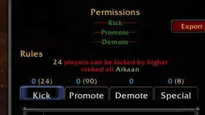

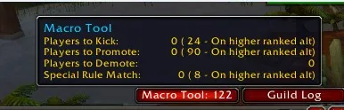

* When you uncheck a macro rule to temporarily disable it, re-checking it will nto force spam your log all of the recommendations of the macro matching again. This felt a bit spammy.

***BUG FIXES***

* Fixed an issue where players names were not showing in the macro tool properly

* Fixed a Lua error that would trigger if when tabbing off the level range boxes in the macro rule creation settings and there was no number there. It will now default back rather than error out.

* Fixed an issue where GRM would not load properly, but only in HC guilds.

* Fixed a Lua error that could occur when

## **VERSION 1.99141 RELEASE - August 31st, 2024**

***NEW FEATURE - CLASSIC ERA ONLY***

*Please note, this feature could technically be added to retail, or Cata Classic, but it has little value as the profession data is not as useful as the built-in profession window in the Guild communities frame, of which doesn't exist in Classic Era.*

Blizzard, when they did the surprise update adding Communities to the Classic Era guild interface, they also let some API slip in that had previously been unavailable, including profession information. I am now able to query the server and pull the 2 main professions, and their rank, of every member of the guild. This is super useful in Classic Era. So, GRM will now give you the option to not only collect the profession information, but export the information to the player note, officer note, or custom public note:

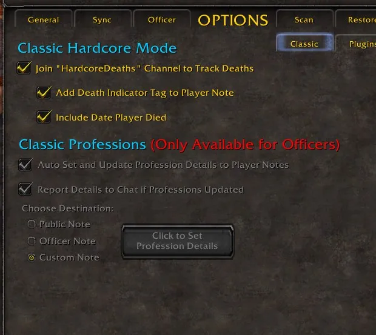

* Feature is available ONLY to officers in the guild.

* Format of the profession details will be like this: **[Eng]/[Alc]300** or **[Eng]300/[Alc]275** if they do not share the same level.

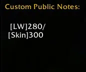

* Profession changes will be auto-updated to the destination note, if you allow it. I have it set to only do 1 report, shortly after login, to prevent note change spam for other GRM users that maybe don't need a note report every single time the profession incrememnts up by 1. You CAN force it to update

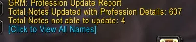

* If there is not enough room in the note, GRM will not overwrite the note already there, but GRM will create a report of all of the players who were not able to be updated. You can click the hyperlink in chat at the end of the report to see the names, and then each of the player names will be hyperlinked to open their respective player window. The report will only report 15 names at a time and a new link will generate when ready to continue viewing the next batch of names, or to ignore.


* If you don't want to wait for the next session, typing `/grm prof` will trigger it to update the profession details.

***QOL***

* Export log window is now properly sized so the hardcore tab doesn't overlap the window to copy the text

* "Realm Name" has been added to the list of Export options for members and former members.

* The log will no longer reset the search box when you jump between tabs. It will now only reset if the entire window has been closed.

* Ctrl-Click entries in the log and if that player is still in the guild, it will open the player window. Note, that if there are 2 names in a log entry, you will go to the name of the player being acted open. Example. If it says "Bill promotes Ted to officer" then the player window that opens will be Ted's window.

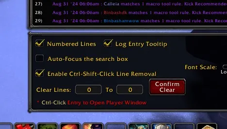

***BUG FIXES***

* An error preventing some people from loading GRM properly should now be resolved. This wwas causing a patch to fail.

* Fixed an issue where when creating a new ban of a player, it would lua error and not sync those changes live to to other GRM users online. This will no longer happen.

* Fixed an issue where GRM might re-report all the ban updates to your log after syncing.

* Fixed an issue where the join date on the mouseover window was stating "Unknown" for the player date in error.


## **VERSION 1.99134 RELEASE - August 27th, 2024**

GRM would not load for guilds that were experiencing issues with double names on the roster, particularly in Classic Era Hardcore guilds where they would die, delete, and make a new toon the same name. For some reason, those names would not get purged from the roster by Blizzard until the weekly maintenance, and that itself wasn't always consistent. In some cases you could have many players with multiple copies of the same name from dying multiple times. This caused a lot of problems. The funny thing is, a guild weekly maintenance might occur, then GRM seems to work again, then all of a sudden as the week progresses it breaks. This is because once again, someone died, deleted, and made a new toon. Just weird Blizz doesn't auto-delete them from the roster if the toon is deleted, but I wrote a fix for it.

Also, while this is somewhat of a common issue in HC mode, it CAN happen in retail. I have seen it where someone realm transfers and the guild ends up showing their name in the guild still.

* GRM can now handle multiple toons with the same name in the roster, and it can identify which toon is the REAL and active toon, and which ones are from the deleted accounts. I do this by reverse engineering the Player GUID, which is just an integer timestamp converted into hexadecimal format. The larger the number, the more recent the toon creation, thus it is easy to determine which is the most recently created toon of all of them.

* The "deleted" accounts will now be auto-tagged with the `[D]-YYYYMMDD` indicator into their notes for officers and guild leaders to see for easy cleanup, but I also added a special mouseover image for toons on the deleted accounts. I should note, that the date added as date died SHOULD be accurate as I base it on the last time they logged in, and since the toon is deleted, just not purged by Blizz yet, I think it's safe to say they won't be logging in again even in the spirit realm.

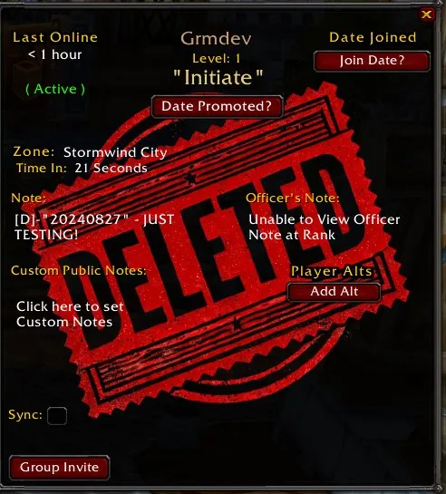

* GRM should now properly run without error and correctly scan for changes again in the roster.


## **VERSION 1.99133 RELEASE - August 26th, 2024**

* Another bug found stopping some from loading. These are almost all ironed out it seems! Sorry about the frequent updates. This affects very few people.

## **VERSION 1.99132 RELEASE - August 26th, 2024**

* Due to a previous issue that caused GRM to not load for some players, they rolled back to a working build. Then, on re-installing GRM, they encountered a new error not allowing them to load again. This error was because GRM was looking to update the Database again, except it had already been done. The patching process will now check to see if the patch had already properly been applied now and GRM should properly load. This bug only affected people who rolled back to an earlier build.

## **VERSION 1.99131 RELEASE - August 26th, 2024**

* For some people, the last update made it so GRM was not updating for them. This is should now be fixed.

* The GRM log mess that a player has been REINVITED is now displaying properly in Russian.


## **VERSION 1.9913 RELEASE - August 25th, 2024**

***BUG FIXES***

* After updating the DB, some may have experienced viewing double mains in a gorup, the groups existed, by I intermingled an Mains helper backup I had for the update to protect against cataclysmic anomalies while I was building this release, that didn't need to be there anymore, and it has been purged. Please note, a side-effect of this is there may be some alts that lose their main status, or some alt groups. This should not be widespread, but it will affect a few people. All you need to do is re-set the toon to be the main and in the group and it will be a one-time hassle. Sorry for this slight hiccup in the DB overhaul of the alt group data!

* Right clicking a player's name and "resetting data" was not fully removing them from alt groups, only resetting some of their personal data. this has been fixed again. Please you, you will notice that if you did this, they will have been re-added back to the alt group as they still were in the alt group, just the reference removed. You will need to re-remove them if you had already, but it shouldn't occur again.

* An older bug that had affected how some data was sorted, incorrectly, has been fixed. This would have caused the sync to error as it was receiving unexpected data in the wrong format. The underlying source of this bug was fixed in the 1.9912 release, so it was not spreading further, but it seems I forgot to repair the previous damage! This is now fixed. Please note, while most dates can be preserved, if some dates were just too broken from the previous bug as to not be exactly clear what the original date saved as was placed, this will be deleted for that player and will need to be reconfigured. This likely will not affect most players, but the few it does will not experiencely it widely as it was somewhat of an isolated bug that was a bit more edge case and not common.

* GRM seemed to be reporting on occasion that a player has returned to the guild after being inactive for 1hr. This is now resolved for all new players updating GRM. Unfortunately I cannot restore the previous announcements as the data was overwritten since they had returned, but any future players that come back from being inactive will now report properly. This was occurring only to players shortly after updating to 1.9912.

* Ctrl-clicking a player's name to open the mouseover window in the macro tool should work again.

* Fixed a slight issue where GRM would not share the alt or custom note data with a player if their rank was too low, even though all date should have been sent outgoing.

* Updated the naming Easter Egg on request for a player/guild (GRM_EE.lua)


## **VERSION 1.9912 RELEASE - August 25th, 2024**

***QUALITY OF LIFE***

* Fairly significant code optimization on the backend in some areas. I won't get into all of the details, but thousands of lines of code have been written. There was a fundamental flaw in how some of the underlying data was stored that needed to be resolved, and it just caused a domino effect that caused me to rewrite so much. For example, nearly the entire sync process has been completely rewritten and changed. The data handling for the alt/main groups has been completely rewritten as well. This is by far the biggest single release I have ever put out. While it is not feature packed on the front-end, so many players may not notice a whole lot differernt, just be aware that this release here represents the biggest single time commitment I have ever given to this addon, and something that was a long-time coming. I have been running a private beta with many members on discord to iron out any issues with this release, due to the scope of it. As always, if you see anything odd, please report it on Discord so it can be resolved!

***GRM IMPROVEMENTS***


**SYNC PROCESS - MASSIVE REWRITE**

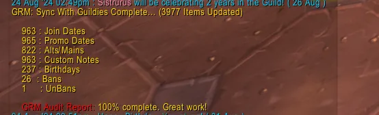

*Nearly the entire sync process has been rewritten from the ground up. This was not a small feat, but absolutely worth it in the end. Let me give you a rundown of some of the "technical" aspects of the changes.*

* In effort to improve sync speed and also efficiency, a "pre-check" is done during the sync process to identify which players had data that did not align between the two players. This entire process has been rewritten and is massively improved over previous efforts. It also will greatly shorten the length of syncing, particularly if most data has already been sync'd. Notably, the database has been broken down into 7 catagories, and when syncing, the database will be converted into a "hash" representation of each chunk of data. By comparing only these hashes to each other, the logic will allow a player to very quickly determine if syncing is even necessasry, and if it is, then only comparing data within this block. Even within each of these blocks of data the precheck will identify only the players whose data does not correspond so only the necessary data is shared.

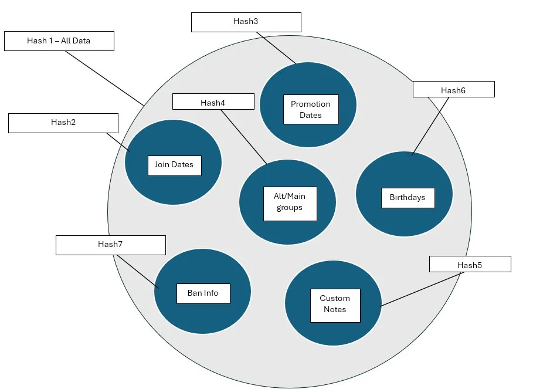

*Anyway, I won't bore you with all of the technical details, as it goes a bit deeper than all of this, I just share this to demonstrate that significant effort and thought has been put into the process, notably to eliminate the long-standing bug of losing some main/alt associations when sync occurs. This should no longer happen in any way.


***SYNC ENHANCEMENTS/CHANGES***

* Sync process is significantly more efficient, and will be faster. While sync can still take a little while the very first time in a mega guild, it is not only shorter than previously, but subsequent smaller syncs will be far quicker.

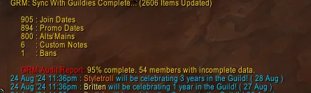

* Alt groups should now accurately report at the end of the sync how many "alts" habe been updated. Before, if you had an alt group with 10 players, and you made a change to that alt group, it would count as "1" alt being changed. In reality, every alt in that group was affected. This will now count properly oin the end of sync tally report.

* Reporting of the Ban changes at end of sync breaks the ban data into 3 categories: Bans, UnBans, and Ban Edits.

* DATA INTEGRITY - This has been greatly improved, as well as more edge case handling for anomalies. For example, I noticed that when syncing, on occasion, for no explanation, sync messages between players across the Blizzard server can just be lost. This is not common, but it happens. You can see this by say, sending 1000 numbers in a sequence to another player, 1 number per message at a time, then when collecting the numbers on the other account, you will find that some messages just never arrived by seeing skipped numbers. Super weird. So, GRM will now cache the messages sent, indexing every single message, then the receiving player will validate they received all the expected messages. Any missing indexed messages will be requested and those will be re-sent. In some cases, messages might just be lost because someone hit the loading screen whilst the other was sending data to them. This can actually save that sync by GRM validating not only which messages never were received, but then being able to continue to sync by requesting the missing messages and continuing on. If anything, this protects against some of the more "edge case" problems that can happen.

* Ban list syncing is about 95% more efficient now than it was previously, so all of you with huge ban lists will no longer experience overly long syncs anymore as a result of you adding even 1 new ban.

* Birthday syncing is significantly smarter as well. Since birthdays are intertwined with alt groups (you only have 1 birthday per alt group, as it is safe to assume 1 birthday per account), the previous method was syncing birthdays by first doing a database comparison check BEFORE alt groups are finalized. The problem here is you can do a birthday comparison, but then you update the alt groups and it changes everything. Now, the birthdate syncing is set in proper order, has also been rewritten, and is much better now. Basically, everything is better in the sync process here!.

* If a player removes a birthdate, it will now properly sync this information. Before, it would share this information successfully with all others currently online, but then you would resync with someone offline and it could overwrite and re-add the birthdate. Apparently no one removes birthdays because this must have been here a very long time without ever getting reported and I only noticed in my overhaul.

* The sync initialization process and "election" behind the scenes (first sync if no designated sync leader yet), is now smoother, quicker, and reliable to trigger it to start properly.

* If sync fails, for whatever the reason, the addon will properly catch it and indicate this to you with a message properly.

* Option to sync bdays enabled/disabled has been removed. It will now just always sync birthday data. You can still disable tracking birthdays if you don't want, but it didn't make sense having two separate settings on this. This is part of the rollout process I have planned to somewhat streamline the configuration and use of syncing data a little better.


***SYNC BUG FIXES***

* Alt lists should now properly sync consistently. Alt groups becoming disassociated on occasion, or mains losing main status during sync should no longer occur. This has been a LONG time coming. I really apologize for the wait for this one, but I really didn't want to just bandaid fix this one.

* Ban lists should now properly sync in full, regardless who triggers. I noticed that on occasion the ban details would not always sync completely, and it depended on who was triggering sync (typically the person who just logged in). This has been completely rebuilt.

* Fixed an issue where it would inform you sync failed to start, yet it didn't actually fail to start as it would strill trigger 1 second later and begin syncing!

* Fixed an issue with sync where if you typed `/grm sync`, in some cases it would fail to start, even if there was someone available to sync. It should be consistent now. It was even saying a person was offline even if they weren't, as a reason why they were failing to sync. This should no longer occur.

* Fixed an issue with Custom Note not syncing wth players currently online when changes are made LIVE. While this would self-resolve when you next did the full sync, this now should properly sync LIVE when changes are made. Additional messaging has been added to inform a player when someone makes a custom note change. There was no messaging prior for some reason and I just never noticed..

* There was an error that could occur after syncing large amounts of data. After the sync completed, if you had accumulated hundreds of join dates and birthdates, whilst also having the setting to be notified of upcoming birthdays and guild anniversaries, this could cause the game to freeze for a few seconds because when adding events to your list to be added to the calendar, GRM will query the server to see if they have already been added to the calendar. This is somewhat a slow query and response when dealing with the calendar API, and thus too many queries can lockup Warcraft. This is typically a non-issue, but after a large sync with hundreds of names updated, all of a sudden sending hundreds of calendar queries to the server caused this anomaly. GRM will now throttle back the queries to a limited amount and space them out properly until fully reported. Most players may never notice this, but larger guilds can experience this.

* Many other bugs, most I won't mention here have been found and resolved. One bug that was constantly causing people issues with GRM crashing as it tried to validate players in the guild who met the Macro rule filters, in particular, turns out to be sourced from a sync issue where I was failing to properly convert types where I had an epoch timestamp being left in string form, which caused many other downstream effects. This had been reported many many times before, and while I could fix it for people temporarily, it could pop up again the next time you sync'd if the conditions were right. This has purged this from ever happening again as the sourec of the bug has been fixed.

* Fixed an issue where a player leaving the guild, when removed from the alt group, it was resetting the epoch timestamp and removing it of that alt group, thus it easily end up overwritten by other changes. This was a fairly critical bug and would only be obvious on a subsequent sync with people who have older data. An example of how this might have screwed up your data is let's say you have been in the guild and you have a player alt group with 5 toons. One of those alts leaves the guild. Now, you still have a 4 player alt group and all seems fine. Syncs still happen normally, but behind the scenes, the underlying metadata timestamp of the change is reset back to zero. When you sync with other players online, nothing seems to cause problems because your database was already aligned. Well, here comes an officer who has been offline for 2 months, logs back in, and their GRM data says that X player is a main, with no alts added yet. Now, GRM takes that as more current info, and wipes the alt group. TERRIBLE! This was actually a bug that stemmed not from the sync process, but when players left, any remaining players that timestamp of change for the alt group was getting reset. It took me a long time to find this bug because I had assumed it was related to a flaw in syncing alone, but instead it was actually affecting groups who had players leave the guild. Really weird, and super easy single line fix as well, just hard to find the source.

***BAN TOOL UPDATE***

*Updated Message that will show only one time if you acknowledge*

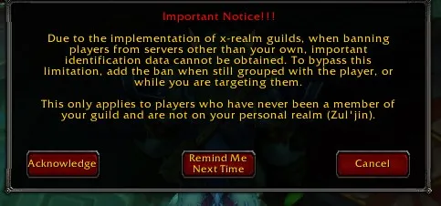

*Quality of Life Updates to the Ban tool for x-realm compatibility*


* As you type, autocomplete will filter out the selections for both realms, and the player names you have ( current and former members ).

* Just mouseover the names and they will populate. Either mouse off or click the name to accept it.

* GRM will now obtain the GUID of a player who is banned by either, and not on your realm, by comparing it to all of the players you are currently grouped with, or are targeting. This is a HUGE limitation if you want to add bans to players who have never been in your guild.

* A MASSIVE security flaw I saw, that I didn't actually realize until I tore apart the sync process, was that when banning players LIVE, GRM would blast out the ban information across the GUILD channel for other GRM users to collect. What would happen is anyone at the proper rank would collect it, and all the other players at a lower rank would just filter it out and ignore the message. Since it is happening all behind the scenes, you would never know. But, let's say you had a tool that collected addon to addon comms to debug, you would have collected the messages that included the ban data even if you weren't the correct rank, as you were still receiving it, just doing nothing with it and ignoring it. Now, GRM handles it a bit more intelligently where instead of just blasting the update out across the GUILD addon comms, it now sends the addon data specifically over the WHISPER comms channel directly to the players who are at the proper rank, individually. While this means additional addon to addon comms as you are sending to each person, this is important for data that should be protected.


***ALT GROUP DATABASE UPDATE, LOGIC HANDLING, MAINS, TOTAL REWRITE***

* If you open up the `GRM_AltManagement.lua` file, and compare it to the one that existed previously, you will find that essentially the entire file has been rewritten, code purged, and the logic of handling alt groups rebuilt. Overall, it should be a more logical process, and it will sync the alt groups as whole entities rather than as individual players. Adding and removing alts, changing mains, and so on should now be a better process. I can't stress this enough. This was a MASSIVE overhaul of some old legacy code I built in the early days of GRM that really needed to be revisited, finally. The key goal here was data integrity.


*** MISC. QUALITY OF LIFE IMPROVEMENTS***

* For some reason when you invite someone to join your guild there is no system message, so you don't even have confirmation it happened. GRM now secure hooks the slash command to guild invite a player and adds the message. It ONLY fires if you successfully sent a message. The server will not tell you when you send a `/ginvite playerName`

* The Macro Tool now has an Enable All/Disable All checkbox to quickly enable and disable rules


***GENERAL BUG FIXES***

* I had previously reported that the bug of promoting/demoting someone manually, then 1 second later the addon saying they got re-promoted or demoted was fixed. I thought I fixed it. I basically did, but I just realized when I was working on another bug that I had a couple variables reversed, which means it wasn't actually fixed! Oops! This is now resolved. I have vigorously tested it with unit tests and in-game testing for verification, so it does seem to be working properly now.

* Fixed an error where you could end up timing out if you were in a really large guild and had several stacking promotion/demotion rules causing a lot of unnecessary cycles of repeated data. This is now handled significantly more efficiently under the hood.

* Fixed an error that could trigger a lua error when trying to display a tooltip on the macro tool window in some cases.

* Fixed a bug that would cause the addon to not load all the macro rules properly. This particularly could affect you if you were a non-officer with GRM installed who was promoted to an officer. This was a slight oversight and has been fixed.

*  `/grm export` command was not working properly unless the GRM log window was open. You should now be able to open the export window now with the slash command properly without needing the GRM window to also be open.

* The `/grm export` level range filters should now be working again.

* There was an issue where in some edge cases where a scan for changes report to the log could get lost as it was recorded to the database, the log entry was set in the temporary que to be reported in a clean consistent wya, but then something occurred that triggered an early kill of the scan so the log entry was reset for next scan before it got reported. This can happen if like, you are reporting a player leveled, but in the middle of the scan, someone quits the guild, so it triggers a quick re-check of the DB. There's this very split second moment where it could get lost. Now, it will ensure that all entries are properly reported to the log in the event of a trigger to kill the scan in light of a notable guild change.

* Fixed an issue where if a player was promoted to an officer role then on the next scan for changes it would say all these officer notes got added. This is not really accurate. They only became visible. It should now not spam the log with this. The same if they were demoted from being an officer. It no longer states that the officer notes were removed. They are just now not visible.

* If a player banned someone who was an Evoker class, but you labeled them the incorrect class, you would get an error indicating a missing localization "key." This will no longer happen.

* On the ban list window, if you have a player in the guild that needs to be removed, but you do not have permissions, it will no longer create an unusable macro and instead properly inform you of your rank limitations.

* Right-click on the birthdate should now properly size the right click window

* Added bday messaging when removing birthdays of players and alt groups.

* At times the "Last Online" was not always showing the correct time exactly. It was mostly correct, but everything has been moved over the the updated communities roster API now that I don't need to accomodate the older API for pulling guild roster info.

* Slash command `/grm clearguild` should no longer cause errors or make it impossible to rescan the database until you next reload, which happened in the case of the timing of this macro and purging the guild while in the middle of a scan for changes.


* Fixed an issue where the "Date Promoted" button will disappear after setting the join date until you refresh the mouseover window. This now should show if the date has not been set.

* The `/grm scan` would sometimes hang until the next log change was detected or roster was opened. The manual initialization of the scan for changes should properly run everytime.

* A lua error was occurring when exporting players with their list of alts in some cases. This will no longer occur.


***SPECIFIC TO CLASSIC ERA - SOD - HC - BUG FIXES***

* HC mode GRM options in the HC tab should now be properly aligned and checkboxes not stacked on top of each other.

* HC mode options settings should no longer be accessible when not in HC mode.

* Some bugs have been causing error with the old Classic guild window have been taken care of. This is a side-effect of the surprise update of adding communities to classic and having to purge old redundant code now. A few frames were overlooked.
